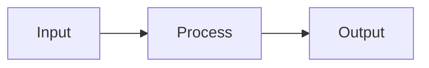

# Plan Files Guidelines

Plan files define **implementation strategies**—the high-level approach for building features or phases. They describe **what** to build and **why**, leaving **how** to the implementation phase.

## Purpose

Plan files answer: **"What are we building, and what's our approach?"**

## What to Include

✅ **Include:**
- Goals and objectives for the feature/phase
- Architecture decisions with rationale
- Component breakdown and responsibilities
- Integration points between components
- Data flow descriptions
- Risk identification and mitigation strategies
- Dependencies on other features or external systems
- Acceptance criteria for the overall feature

✅ **Allowed for illustration:**
- Pseudo-code to explain algorithms or logic flow
- Mermaid diagrams (flowcharts, sequence diagrams, architecture diagrams)
- Interface definitions (inputs/outputs, data contracts)
- Example data structures (conceptual, not language-specific)

❌ **Do NOT include:**
- Actual implementation code
- Library-specific API calls or syntax
- Concrete class/function implementations
- Import statements or module structures

## File Naming

Use descriptive names that identify the feature or phase:
- `phase-1-foundation.md` — Foundation setup phase
- `phase-2-core-pipeline.md` — Core processing pipeline
- `user-authentication.md` — Authentication feature

## Structure Template

```markdown
# [Feature/Phase Name]

## Overview
What this feature/phase accomplishes and why it's needed.

## Goals
- Goal 1
- Goal 2

## Architecture

### Components
Describe the main components and their responsibilities.

### Data Flow
Explain how data moves through the system.



## Interface Definitions

### Inputs
- What the feature receives

### Outputs
- What the feature produces

## Error Handling
What error conditions exist and how they should be communicated.

## Risks & Mitigations
| Risk | Mitigation |
|------|------------|
| Risk 1 | How to address it |

## Dependencies
- Links to relevant context files
- External dependencies

## Acceptance Criteria
- [ ] Criterion 1
- [ ] Criterion 2
```

## Principles

1. **Describe outcomes, not implementations** — "The system validates URLs" not "Use regex pattern X"
2. **Explain trade-offs** — Document why you chose one approach over alternatives
3. **Stay stable** — A good plan shouldn't need changes when implementation details evolve
