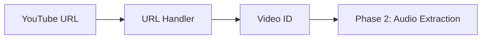

# Phase 1: Foundation & Project Setup

## Overview

This phase establishes the project foundation, including dependency installation, project structure, and core data models. This creates the building blocks that all subsequent phases depend on.

**Estimated Effort**: 1-2 hours
**Dependencies**: None (starting point)

---

## Goals

1. Set up project dependencies and verify they work
2. Create the module structure for clean separation of concerns
3. Define custom error types for granular error handling
4. Implement core data models
5. Implement YouTube URL parsing and validation

---

## Architecture

### Module Structure

```
src/subsync/
├── __init__.py          # Package exports
├── cli.py               # CLI entry point (exists)
├── errors.py            # Custom exceptions
├── models.py            # Data classes
└── url_handler.py       # YouTube URL parsing
```

**Rationale**: Flat structure for simplicity. Subdirectories can be added if complexity grows in later phases.

### Data Flow



---

## Architecture Decisions

### Data Classes vs Pydantic

**Decision**: Use standard library `dataclass` for now.

**Rationale**:
- Simpler, no additional dependency
- Sufficient for current validation needs
- Can migrate to Pydantic later if needed for advanced validation

**Trade-offs**:
- Pro: Zero additional dependencies
- Pro: Familiar Python standard library
- Con: Less automatic validation than Pydantic

### Exception Hierarchy

**Decision**: Custom exception hierarchy rooted at `SubSyncError`.

**Rationale**:
- Enables granular error handling at call sites
- CLI can catch specific exceptions for user-friendly messages
- Follows Python best practices for library design

---

## Components

### 1. Dependencies

Install and verify all required dependencies for audio extraction and transcription.

**Required packages**:
- `yt-dlp`: YouTube metadata and audio download
- `openai-whisper`: Speech-to-text transcription
- `rich`: CLI progress display

**System requirements**:
- FFmpeg must be available in PATH

**Context**: [dependencies.md](../context/dependencies.md)

### 2. Error Definitions

Create a custom exception hierarchy that enables:
- Granular error handling at call sites
- User-friendly error messages in CLI
- Clear categorization of failure modes

**Error types needed**:

| Error | Purpose |
|-------|---------|
| SubSyncError | Base for all SubSync errors |
| URLParseError | Invalid/unsupported YouTube URL |
| VideoUnavailableError | Video is private, deleted, or region-locked |
| AgeRestrictedError | Video requires age verification |
| LiveStreamError | Live streams not supported |
| TranscriptionError | Audio transcription failures |

### 3. Data Models

Implement all data models defined in the context documentation.

**Models to implement**:
- VideoMetadata
- Word, TranscriptionSegment, TranscriptionResult
- Subtitle, SubtitleFile
- TimingValidation, ComplianceReport
- TranscriptionConfig, ProcessingConfig, OutputConfig

**Context**: [data-models.md](../context/data-models.md)

### 4. URL Handler

Parse and validate YouTube URLs, extracting the video ID.

**Supported URL patterns**:
- Standard: `https://www.youtube.com/watch?v=VIDEO_ID`
- Short: `https://youtu.be/VIDEO_ID`
- Embed: `https://www.youtube.com/embed/VIDEO_ID`
- Legacy: `https://www.youtube.com/v/VIDEO_ID`
- With parameters: URLs containing playlist, timestamp, etc.

**Video ID validation rules**:
- Exactly 11 characters
- Only alphanumeric characters plus `-` and `_`
- Case-sensitive

**Context**: [youtube-compatibility.md](../context/youtube-compatibility.md)

---

## Interface Definitions

### URL Handler

**Inputs**:
- YouTube video URL (string)

**Outputs**:
- 11-character video ID (string)

**Errors**:
- URLParseError when URL is invalid or not from YouTube

---

## Error Handling

| Error Condition | Error Type | User Message |
|-----------------|------------|--------------|
| URL not from YouTube domain | URLParseError | "Not a YouTube URL" |
| No video ID in URL | URLParseError | "URL does not contain a video ID" |
| Invalid video ID format | URLParseError | "Invalid video ID format" |

---

## Risks & Mitigations

| Risk | Impact | Mitigation |
|------|--------|------------|
| FFmpeg not installed | Blocks audio extraction | Document in README, check at startup |
| Whisper model download slow | Poor first-run experience | Document expected download time |
| GPU/CUDA issues | Transcription very slow | Auto-fallback to CPU, document |

---

## Acceptance Criteria

- [ ] All dependencies installed successfully
- [ ] FFmpeg available and verified
- [ ] All error types defined and importable
- [ ] All models defined and importable with correct computed properties
- [ ] URL handler parses all supported URL formats
- [ ] URL handler rejects invalid URLs with clear error messages
- [ ] All unit tests pass
- [ ] Linting passes with no errors

---

## Dependencies

- [data-models.md](../context/data-models.md) - Model definitions
- [dependencies.md](../context/dependencies.md) - Package information
- [youtube-compatibility.md](../context/youtube-compatibility.md) - URL patterns

---

## Next Phase

After Phase 1 completion, proceed to [Phase 2: Core Pipeline](./phase-2-core-pipeline.md) which implements audio extraction and transcription.
