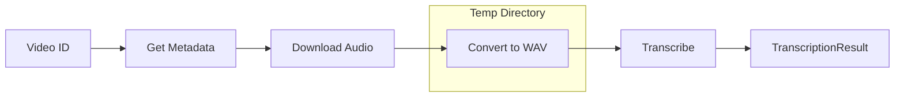

# Phase 2: Core Pipeline (Audio Extraction & Transcription)

## Overview

This phase implements the core processing pipeline: extracting audio from YouTube videos and transcribing it to text with timestamps. This is the technical heart of SubSync.

**Estimated Effort**: 3-4 hours
**Dependencies**: Phase 1 complete

---

## Goals

1. Extract video metadata via yt-dlp
2. Download and convert audio to optimal format
3. Transcribe audio using Whisper with timestamps
4. Establish temporary file management
5. Add progress reporting infrastructure

---

## Architecture

### Pipeline Flow



### Component Responsibilities

| Component | Input | Output | Responsibility |
|-----------|-------|--------|----------------|
| Audio Extractor | Video ID | VideoMetadata | Extract video information |
| Audio Extractor | Video ID, Output Dir | Audio File Path | Download and convert audio |
| Transcriber | Audio Path, Config | TranscriptionResult | Speech-to-text with timestamps |
| Pipeline Orchestrator | URL | TranscriptionResult | Coordinate full pipeline |

---

## Architecture Decisions

### Temporary File Management

**Decision**: Use context managers for automatic cleanup.

**Rationale**:
- Automatic cleanup on success or failure
- Cross-platform compatibility
- No orphaned files on crashes

### Whisper Model Selection

**Decision**: Default to "turbo" model with CLI override.

**Rationale**:
- Best balance of speed and accuracy
- ~6GB VRAM fits most modern GPUs
- 8x faster than large-v3 with similar quality

**Trade-offs**:
- Pro: Fast processing
- Pro: Good accuracy for most content
- Con: Requires GPU for reasonable speed

### Audio Format

**Decision**: Convert to WAV format (16kHz, mono).

**Rationale**:
- Whisper's optimal input format
- No lossy compression artifacts
- Larger file size acceptable for temporary files

---

## Components

### 1. Audio Extractor

**Responsibilities**:
- Extract video metadata without downloading video
- Download audio stream only
- Convert to Whisper-optimal format (16kHz mono WAV)
- Report download progress

**Behavior**:

```
GIVEN a valid video ID
WHEN extracting metadata
THEN return VideoMetadata with title, duration, uploader, upload_date

GIVEN an unavailable video ID
WHEN extracting metadata
THEN raise appropriate error (VideoUnavailableError, AgeRestrictedError, etc.)

GIVEN a video ID and output directory
WHEN downloading audio
THEN save WAV file to output directory and return path
```

**Error Mapping**:

| yt-dlp Condition | SubSync Error |
|------------------|---------------|
| Video unavailable | VideoUnavailableError |
| Private video | VideoUnavailableError |
| Age-restricted | AgeRestrictedError |
| Live stream | LiveStreamError |

### 2. Transcriber

**Responsibilities**:
- Load Whisper model (with caching for reuse)
- Transcribe audio with word-level timestamps
- Handle GPU/CPU device selection and fallback
- Report transcription progress

**Behavior**:

```
GIVEN an audio file path and config
WHEN transcribing
THEN return TranscriptionResult with segments and word timestamps

GIVEN a config with language=null
WHEN transcribing
THEN auto-detect language and include in result

GIVEN GPU unavailable
WHEN loading model with device="auto"
THEN fall back to CPU automatically
```

### 3. Pipeline Orchestrator

**Responsibilities**:
- Coordinate the full URL → Transcription flow
- Manage temporary directory lifecycle
- Report overall progress across stages
- Ensure cleanup on success or failure

**Pipeline Stages**:

```
1. Parse URL → Extract video ID
2. Get Metadata → Validate video availability
3. Download Audio → Progress: 0-50%
4. Transcribe → Progress: 50-100%
5. Cleanup → Automatic via context manager
```

---

## Interface Definitions

### Audio Extractor

**get_video_metadata**:
- Input: video_id (string)
- Output: VideoMetadata
- Errors: VideoUnavailableError, AgeRestrictedError, LiveStreamError

**download_audio**:
- Input: video_id (string), output_dir (path), progress_callback (optional)
- Output: Path to WAV file
- Errors: VideoUnavailableError, network errors

### Transcriber

**transcribe_audio**:
- Input: audio_path (path), config (TranscriptionConfig), progress_callback (optional)
- Output: TranscriptionResult
- Errors: TranscriptionError

---

## Error Handling

| Error Condition | Error Type | Recovery |
|-----------------|------------|----------|
| Video not found | VideoUnavailableError | User message with URL check suggestions |
| Private video | VideoUnavailableError | User message about privacy |
| Age-restricted | AgeRestrictedError | User message (no workaround without cookies) |
| Live stream | LiveStreamError | User message to wait for completion |
| Model load failure | TranscriptionError | Fallback to smaller model or CPU |
| Network timeout | Retry with backoff, then fail |

---

## Risks & Mitigations

| Risk | Impact | Mitigation |
|------|--------|------------|
| yt-dlp API changes | Breaks extraction | Pin version, monitor updates |
| Large videos timeout | User frustration | Add timeout config, show progress |
| Whisper OOM on GPU | Crash | Catch exception, retry on CPU |
| No word timestamps | Less precise subtitles | Fall back to segment timing |

---

## Performance Considerations

| Video Length | Expected Download Time | Expected Transcribe Time (turbo, GPU) |
|--------------|------------------------|---------------------------------------|
| 5 min | ~30s | ~30s |
| 30 min | ~2 min | ~3 min |
| 2 hours | ~10 min | ~15 min |

**Recommendations**:
- Show progress for operations > 5 seconds
- Document expected processing times for users
- Consider async processing for very long videos (future enhancement)

---

## Acceptance Criteria

- [ ] Can extract metadata from public YouTube videos
- [ ] Can download and extract audio to WAV format
- [ ] Can transcribe audio with Whisper
- [ ] Word timestamps are included when available
- [ ] Language auto-detection works
- [ ] GPU used when available, CPU fallback works
- [ ] Temporary files are cleaned up automatically
- [ ] Progress is reported during long operations
- [ ] All unit tests pass
- [ ] Error cases produce clear, actionable messages

---

## Dependencies

- [dependencies.md](../context/dependencies.md) - yt-dlp and Whisper details
- [data-models.md](../context/data-models.md) - VideoMetadata, TranscriptionResult

---

## Next Phase

After Phase 2 completion, proceed to [Phase 3: Netflix Compliance](./phase-3-netflix-compliance.md) which processes the transcription into compliant subtitles.
