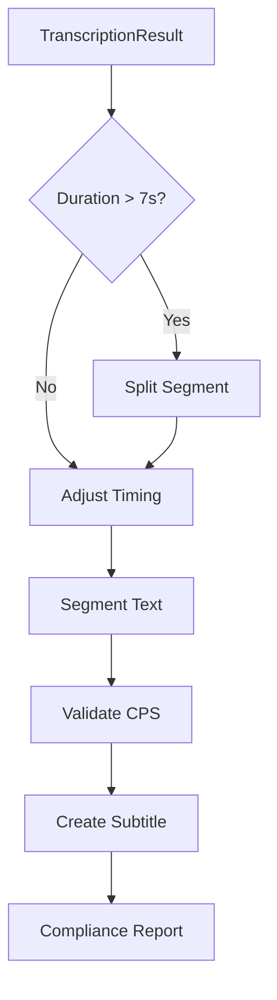

# Phase 3: Netflix Compliance Processing

## Overview

This phase implements the subtitle processor that transforms raw transcription segments into Netflix-compliant subtitle events. This handles timing adjustments, text segmentation, and compliance validation.

**Estimated Effort**: 4-5 hours
**Dependencies**: Phase 2 complete

---

## Goals

1. Validate and adjust subtitle timing
2. Implement intelligent text segmentation (line breaks)
3. Validate reading speed (CPS)
4. Generate compliant Subtitle events from transcription
5. Produce compliance reports for user feedback

---

## Architecture

### Processing Flow



### Component Responsibilities

| Component | Input | Output | Responsibility |
|-----------|-------|--------|----------------|
| Timing Processor | Segment | Adjusted Segment(s) | Enforce duration limits and gaps |
| Text Segmenter | Text | Lines (1-2) | Apply line break rules |
| CPS Validator | Subtitle | Validation Result | Check reading speed |
| Subtitle Processor | TranscriptionResult | Subtitles + Report | Orchestrate full processing |

---

## Architecture Decisions

### Transform, Don't Mutate

**Decision**: Processing creates new subtitle objects rather than modifying transcription segments.

**Rationale**:
- Clear separation between raw data and processed output
- Easier to debug and test
- Can compare before/after if needed

### Line Breaking Strategy

**Decision**: Rule-based breaking with linguistic heuristics.

**Rationale**:
- Predictable, testable behavior
- No ML dependency for text processing
- Can be tuned with configuration

**Alternative Considered**: NLP-based sentence parsing
- Rejected: Overkill for subtitle line breaks, adds unnecessary dependency

### CPS Handling

**Decision**: Warn but don't block on CPS violations.

**Rationale**:
- Transcription accuracy shouldn't be sacrificed
- User can review flagged subtitles
- Automatic fixes may worsen quality

---

## Components

### 1. Timing Processor

**Responsibilities**:
- Validate subtitle durations (833ms - 7000ms)
- Ensure minimum gaps between subtitles (83ms)
- Adjust timings when violations detected
- Split segments that exceed maximum duration

**Timing Rules**:

```
IF duration < 833ms:
    Extend end time to meet minimum
    (unless would overlap next segment)

IF duration > 7000ms:
    Split using word timestamps
    Prefer breaking at sentence/clause boundaries
    Create multiple segments

IF gap from previous < 83ms:
    Adjust start time to create gap
    Recalculate duration
```

**Context**: [netflix-compliance.md](../context/netflix-compliance.md)

### 2. Text Segmenter

**Responsibilities**:
- Split text into 1-2 lines
- Respect 42 character per line limit
- Apply linguistic line break rules
- Handle text requiring multiple subtitle events

**Line Break Priority** (from Netflix Style Guide):

1. **After punctuation** (. , ! ? :) - Best breaks
2. **Before conjunctions** (and, but, or, so)
3. **Before prepositions** (in, on, at, to, for, of, with)

**Avoid Breaking**:
- Between article and noun ("the | dog" ❌)
- Between adjective and noun ("big | house" ❌)
- Between first and last name
- Between verb and subject pronoun

### 3. CPS Validator

**Responsibilities**:
- Calculate characters per second
- Flag subtitles exceeding limits (20 CPS adult, 17 CPS children)
- Suggest adjustments when possible (extend duration)

**CPS Calculation**:
```
CPS = total_characters / duration_seconds
```

### 4. Subtitle Processor

**Responsibilities**:
- Orchestrate full processing pipeline
- Convert TranscriptionResult to list of Subtitles
- Generate compliance report summarizing issues

**Processing Sequence**:

```
FOR each segment in transcription:
    1. Check if needs splitting (duration > 7s OR chars > 84)
       → Split into sub-segments if needed

    2. For each (sub-)segment:
       a. Apply timing rules (duration, gaps)
       b. Segment text into lines (max 2, max 42 chars each)
       c. Validate CPS (flag warnings if exceeded)
       d. Create Subtitle object

    3. Add to results, increment index

OUTPUT: list[Subtitle], ComplianceReport
```

---

## Interface Definitions

### Timing Processor

**validate_timing**:
- Input: Subtitle, previous_end_time (optional)
- Output: TimingValidation

**adjust_duration**:
- Input: Subtitle, min_ms
- Output: Subtitle (adjusted)

**ensure_gap**:
- Input: Subtitle, previous_end_time, min_gap_ms
- Output: Subtitle (adjusted)

**split_long_segment**:
- Input: TranscriptionSegment, max_duration_ms
- Output: list of TranscriptionSegment

### Text Segmenter

**segment_text**:
- Input: text (string), max_chars_per_line
- Output: list of strings (1-2 lines)

**needs_multiple_subtitles**:
- Input: text (string), max_total_chars
- Output: boolean

### CPS Validator

**validate_cps**:
- Input: Subtitle, max_cps
- Output: (is_valid: boolean, warning_message: optional string)

### Subtitle Processor

**process_transcription**:
- Input: TranscriptionResult, ProcessingConfig
- Output: (list of Subtitle, ComplianceReport)

---

## Error Handling

| Condition | Behavior |
|-----------|----------|
| Empty segment text | Skip segment |
| Single word > 42 chars | Truncate with ellipsis, add warning |
| Overlapping timestamps | Adjust to create gaps |
| No word timestamps | Use segment timing for splits |
| All caps text | Preserve (don't modify case) |

---

## Edge Cases

| Case | Expected Behavior |
|------|-------------------|
| Empty segment | Skip, don't create subtitle |
| Single very long word | Truncate with ellipsis, warn in report |
| Overlapping timestamps from Whisper | Adjust to enforce gaps |
| Consecutive very short segments | Consider merging if combined < 7s |
| Special characters/Unicode | Preserve, handle in output encoding |

---

## Risks & Mitigations

| Risk | Impact | Mitigation |
|------|--------|------------|
| Aggressive splitting | Choppy subtitles | Use word timestamps when available |
| Poor line breaks | Awkward reading | Comprehensive break rules |
| CPS always exceeded | User annoyance | Make it a warning, not error |

---

## Acceptance Criteria

- [ ] Short segments (< 833ms) are extended
- [ ] Long segments (> 7000ms) are split appropriately
- [ ] Minimum 83ms gap between consecutive subtitles
- [ ] Lines respect 42 character limit
- [ ] Maximum 2 lines per subtitle
- [ ] Line breaks follow Netflix priority rules
- [ ] CPS calculated correctly
- [ ] High CPS subtitles flagged in compliance report (not blocked)
- [ ] Compliance report summarizes all issues
- [ ] All unit tests pass

---

## Dependencies

- [netflix-compliance.md](../context/netflix-compliance.md) - Timing and formatting rules
- [data-models.md](../context/data-models.md) - Subtitle, ComplianceReport models

---

## Next Phase

After Phase 3 completion, proceed to [Phase 4: CLI & Output](./phase-4-cli-output.md) which implements the subtitle writer and CLI interface.
