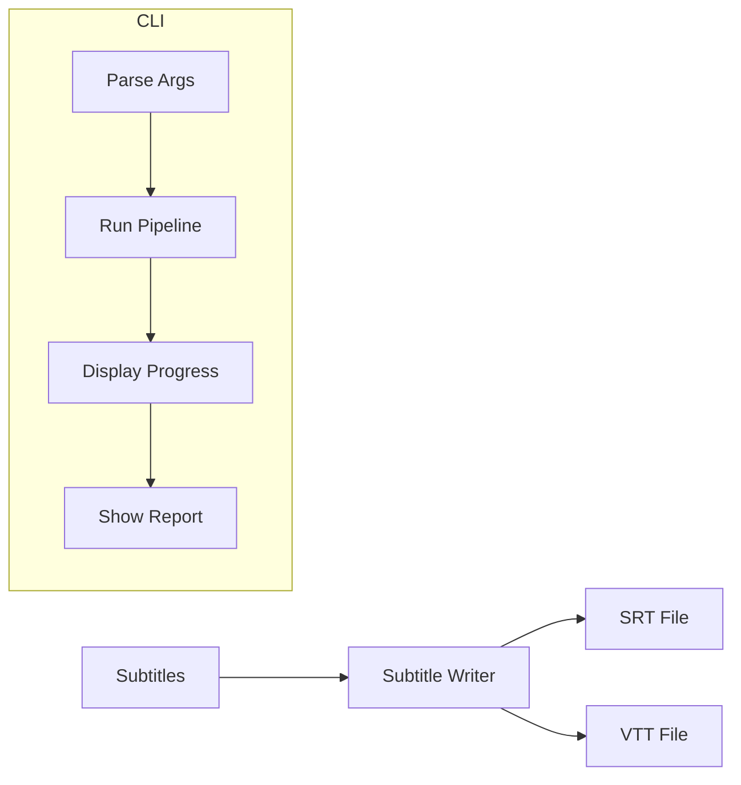

# Phase 4: CLI & Output Generation

## Overview

This phase completes the application by implementing the subtitle file writer, CLI interface, and user experience polish. This is where everything comes together into a usable tool.

**Estimated Effort**: 3-4 hours
**Dependencies**: Phase 3 complete

---

## Goals

1. Implement SRT and VTT file writers
2. Implement full CLI with `generate` command
3. Add progress display and user feedback
4. Handle errors gracefully with actionable messages
5. Document usage and provide examples

---

## Architecture

### Output Flow



### Component Responsibilities

| Component | Input | Output | Responsibility |
|-----------|-------|--------|----------------|
| Subtitle Writer | Subtitles, Format | File | Generate SRT/VTT files |
| CLI | User Args | Exit Code | Orchestrate user interaction |
| Progress Display | Stage, Percent | Console Output | Show progress to user |

---

## Architecture Decisions

### CLI Framework

**Decision**: Use `argparse` (stdlib) with `rich` for output.

**Rationale**:
- No additional CLI framework dependency
- `argparse` is sufficient for current needs
- `rich` provides beautiful progress bars and formatted output
- Can migrate to `typer` or `click` later if needed

**Trade-offs**:
- Pro: Minimal dependencies
- Con: More verbose than typer/click

### Output File Naming

**Decision**: `{sanitized_title}.{language}.{format}`

**Example**: `My Video Title.en.srt`

**Rationale**:
- Includes language code for multi-language support (future)
- Title makes files identifiable
- Standard extension for format recognition

### Exit Codes

| Code | Meaning |
|------|---------|
| 0 | Success |
| 1 | General error |
| 2 | Invalid arguments |
| 3 | Video unavailable |
| 4 | Transcription failed |
| 5 | File write error |

---

## Components

### 1. Subtitle Writer

**Responsibilities**:
- Generate SRT format output
- Generate VTT format output
- Handle file encoding (UTF-8)
- Sanitize filenames for cross-platform compatibility

**SRT Format**:
```
[index]
[start] --> [end]
[line 1]
[line 2 (optional)]

```
Time format: `HH:MM:SS,mmm` (comma separator)

**VTT Format**:
```
WEBVTT

[start] --> [end]
[line 1]
[line 2 (optional)]

```
Time format: `HH:MM:SS.mmm` (period separator)

**Context**: [youtube-compatibility.md](../context/youtube-compatibility.md)

### 2. CLI Interface

**Command Structure**:
```
subsync generate <youtube_url> [OPTIONS]
```

**Arguments**:
- `youtube_url`: YouTube video URL (required)

**Options**:

| Option | Description | Default |
|--------|-------------|---------|
| `-l, --language` | Audio language code | auto-detect |
| `-o, --output` | Output file path | ./{title}.{lang}.srt |
| `-f, --format` | Output format (srt, vtt) | srt |
| `-m, --model` | Whisper model name | turbo |
| `--children` | Apply stricter CPS for children's content | false |
| `-v, --verbose` | Show detailed progress | false |
| `--version` | Show version | - |
| `--help` | Show help | - |

### 3. Progress Display

**Expected Output**:
```
⠋ Fetching video metadata...
✓ Video: "Introduction to Python" (12:34)

⠋ Downloading audio... ━━━━━━━━━━━━━━━━━━━━ 100%
✓ Audio extracted

⠋ Transcribing audio... ━━━━━━━━━━━━━━━━━━━━ 100%
✓ Transcription complete (45 segments)

⠋ Processing subtitles...
✓ Generated 52 subtitles

Output: Introduction to Python.en.srt
```

### 4. Error Messages

User-friendly error display for each error type:

| Error Type | Message Theme |
|------------|---------------|
| VideoUnavailableError | Check URL, video may be private/deleted |
| AgeRestrictedError | Age verification required, not supported |
| LiveStreamError | Wait for stream to end |
| TranscriptionError | Try smaller model, check audio quality |
| URLParseError | Invalid URL format |

### 5. Filename Sanitization

**Rules**:
- Remove characters invalid on any OS: `< > : " / \ | ? *`
- Replace multiple spaces with single space
- Trim whitespace
- Truncate to reasonable length (100 chars)
- Fallback to "subtitles" if title becomes empty

---

## Interface Definitions

### Subtitle Writer

**write_srt**:
- Input: list of Subtitle, output_path
- Output: None (writes file)
- Errors: IOError on write failure

**write_vtt**:
- Input: list of Subtitle, output_path
- Output: None (writes file)

**format_srt_time**:
- Input: timedelta
- Output: string "HH:MM:SS,mmm"

**format_vtt_time**:
- Input: timedelta
- Output: string "HH:MM:SS.mmm"

### CLI

**main**:
- Input: sys.argv (implicit)
- Output: exit code (int)

---

## User Experience

### Success Output

```
✓ Subtitles generated successfully!

  File: Introduction to Python.en.srt
  Duration: 12:34
  Subtitles: 156
  Language: English (detected)

  Compliance:
    ✓ Timing: All requirements met
    ⚠ Reading Speed: 3 subtitles exceed 20 CPS (flagged for review)

  Ready to upload to YouTube!
```

### Error Output

```
✗ Error: Video not found or unavailable

  Please check:
  • The URL is correct
  • The video is public
  • The video hasn't been deleted

  URL: https://www.youtube.com/watch?v=INVALID
```

---

## Error Handling

| Error Condition | Exit Code | User Guidance |
|-----------------|-----------|---------------|
| Invalid URL | 2 | Show expected URL formats |
| Video unavailable | 3 | Check URL, privacy, deletion |
| Transcription fails | 4 | Try smaller model, check audio |
| Cannot write file | 5 | Check permissions, disk space |
| User cancellation (Ctrl+C) | 1 | Clean up temp files |

---

## Risks & Mitigations

| Risk | Impact | Mitigation |
|------|--------|------------|
| Long processing time | User cancels | Show progress with ETA |
| Disk full during write | Lost work | Check space before writing |
| Invalid filename chars | Cross-platform issues | Sanitize all titles |

---

## Acceptance Criteria

- [ ] `subsync generate <url>` works end-to-end
- [ ] SRT files are valid and uploadable to YouTube
- [ ] VTT files are valid (when `--format vtt`)
- [ ] Progress is displayed during processing
- [ ] Compliance report shown after generation
- [ ] Errors display helpful, actionable messages
- [ ] `--help` shows complete usage information
- [ ] Exit codes are correct for different error types
- [ ] Output filename is safe for all operating systems
- [ ] `--verbose` shows additional debug information
- [ ] Keyboard interrupt (Ctrl+C) handled gracefully

---

## Documentation Updates

After Phase 4, update:

1. **README.md**: Installation, quick start, examples
2. **--help**: Comprehensive and accurate
3. **CHANGELOG.md**: Document initial release

---

## Future Enhancements (Post-MVP)

Not in scope for Phase 4, but system designed to support:

- `subsync translate` command
- Batch processing multiple videos
- Configuration file support
- Custom compliance profile selection
- SRT/VTT input for re-processing

---

## Dependencies

- [youtube-compatibility.md](../context/youtube-compatibility.md) - SRT/VTT format specs
- [data-models.md](../context/data-models.md) - Subtitle, SubtitleFile models

---

## Completion Checklist

After all phases complete:

- [ ] All unit tests pass
- [ ] All integration tests pass
- [ ] Linting passes
- [ ] README updated with usage instructions
- [ ] Manual testing with 3+ different videos
